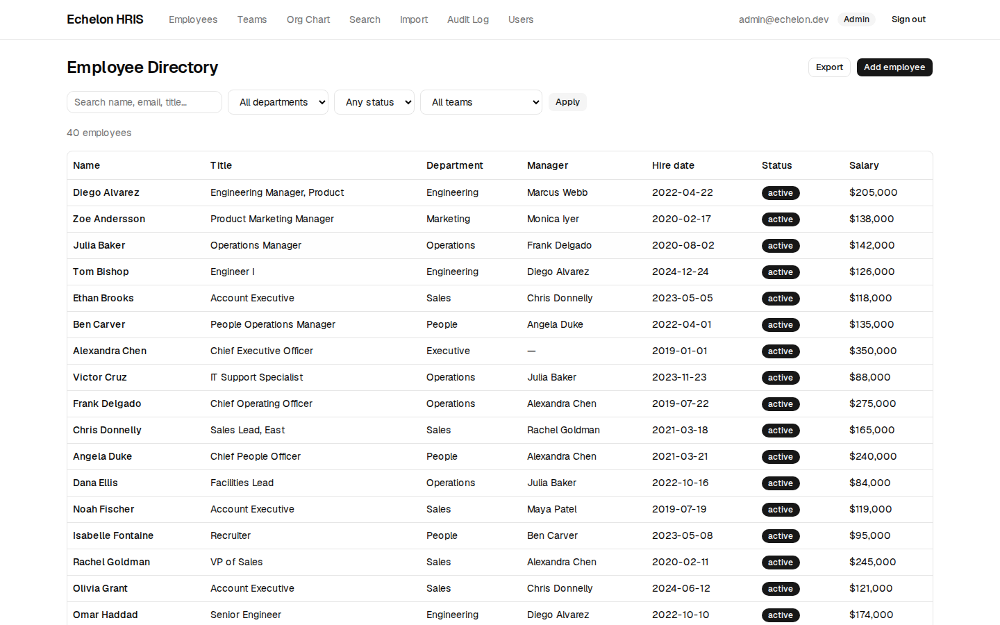
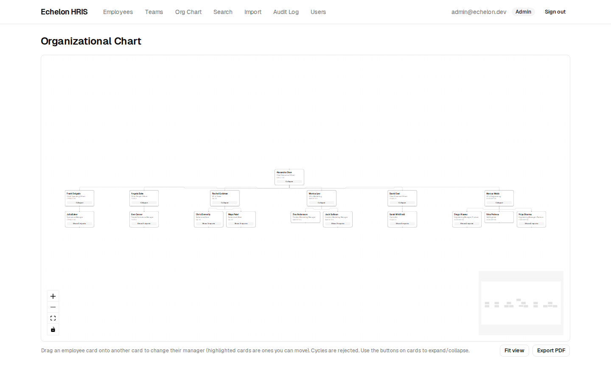

# Echelon HRIS

A lightweight HRIS built as an Echelon take-home project. Features include:

* Employee and team directories
* Interactive drag-and-drop org chart
* Bulk CSV/Excel import with dry-run previews
* CSV, Excel, and PDF exports
* Full audit logging
* Role-based access control (RBAC)

Built with Next.js App Router, Drizzle ORM, Postgres (Neon), and WorkOS AuthKit.

## Live Demo

Demo: https://echelon-os-hris.vercel.app

The app is deployed on Vercel with Neon Postgres and WorkOS authentication. The database is seeded with a demo organization containing ~40 employees.

| Directory | Org chart |
|---|---|
|  |  |

### Signing In

New users are assigned the Viewer role by default.

This is intentional. Viewers can browse the employee directory, teams, org chart, and search functionality, but they cannot make changes or access administrative features.

The app supports four roles:

* Admin – full access
* HR – employee management, imports/exports, audit logs
* Manager – can manage direct reports
* Viewer – read-only access

The role matrix is also available in the in-app About page.

For reviewers, I can grant elevated permissions if you'd like to test import flows, employee editing, audit logs, or user management.

## Running Locally

```bash
npm install
npm run db:setup
npm run dev
```

This initializes a local PGlite database, applies the schema, and seeds the application with demo data.

Open:

```text
http://localhost:3000
```

If WorkOS credentials are not configured, the application automatically falls back to a development authentication mode with one-click personas for every role.

No external services are required.

## Tests

```bash
npm test
npm run typecheck
```

Current test coverage focuses on:

* Authorization rules
* Import resolution logic
* Org-chart cycle detection
* Recursive hierarchy queries

## Production Setup

### Neon

Create a Neon database and add the connection string to:

```env
DATABASE_URL=
```

Then run:

```bash
npm run db:setup
```

### WorkOS

Configure:

```env
WORKOS_API_KEY=
WORKOS_CLIENT_ID=
WORKOS_COOKIE_PASSWORD=
```

Add the appropriate callback URL in WorkOS:

```text
https://your-domain.com/callback
```

### Vercel

Import the repository and configure the environment variables above.


### First User Bootstrap

The first account to sign in becomes an Admin automatically.

All future accounts start as Viewers until an Admin promotes them.

## Design Decisions

A few decisions I made and why.

### Users and Employees Are Separate

Users represent authenticated accounts.

Employees represent HR records.

Those concepts overlap often, but they're not actually the same thing. Real systems frequently have employees who never log in and users who aren't employees at all (auditors, consultants, investors, etc.).

Keeping them separate avoids a lot of awkward edge cases later.

### Adjacency Lists for the Org Chart

The reporting hierarchy is stored as:

```text
employee -> manager_id
```

Hierarchy queries use recursive CTEs.

This keeps re-parenting simple, which matters because the org chart is designed around drag-and-drop editing.

Cycle detection runs during updates and imports to prevent invalid reporting structures.

### Compensation Lives in Its Own Table

Salary data is stored separately from employee records.

This makes authorization easier and reduces the chance that a future endpoint accidentally exposes compensation information.

One extra join is a small price to pay for cleaner security boundaries.

### Current-State Data + Audit Log

The system stores current state and an append-only audit log.

A fully versioned HR system would be more accurate, but it would also add a significant amount of complexity that isn't necessary for this scope.

The tradeoff is that historical reconstruction ("what did the org chart look like six months ago?") isn't currently supported.

### Authorization in the Repository Layer

All database access goes through the repository layer.

Authorization rules live below routes, actions, and UI components, which means features can't accidentally bypass permission checks.

The rules themselves are pure functions and are covered by tests.

### Bulk Imports

Imports follow a two-step process:

1. Parse and validate client-side
2. Re-validate and commit server-side

Everything is committed inside a single transaction.

I chose all-or-nothing imports because a partially imported organization is usually harder to recover from than simply fixing the file and retrying.

## Known Limitations

* No point-in-time organization reconstruction
* Imports are capped at 5,000 rows
* Salary values are stored as annual integer amounts
* Org-chart PDF exports capture the current visible chart state
* Development auth should never be used in production

## Project Structure

```text
src/db/                 Database schema and driver setup
src/lib/authz.ts        Authorization rules
src/lib/tree.ts         Recursive hierarchy queries
src/lib/audit.ts        Audit logging
src/lib/validation.ts   Shared validation schemas
src/repo/               Repository layer
src/actions/            Server actions
src/app/                Routes and API endpoints
scripts/seed.ts         Demo data generation
tests/                  Unit and integration tests
docs/                   User and admin documentation
```
